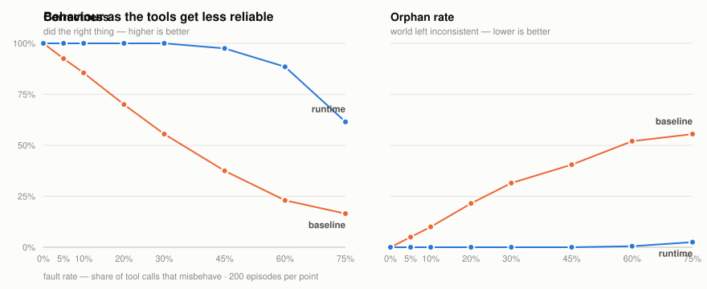

# Backstop

**Agents are benchmarked on a good day. This measures what happens on a bad one — and then engineers the difference.**

Give an LLM agent some tools and a multi-step task and it will usually succeed,
because the tools usually work. Production tools do not usually work. They time
out, rate-limit, return truncated bodies, quietly rename a field — and, worst,
they *succeed and lose the response*, so the agent retries and charges the
customer twice.

Backstop is a testbed for that. It has a simulated ops world with real side
effects, a deterministic fault injector in front of it, and a recovery runtime
whose every protection is an independent switch — so the question "which of
these actually prevents which harm?" has a measured answer instead of a
confident one.

<picture>
  <source media="(prefers-color-scheme: dark)" srcset="results/curve-dark.svg">
  
</picture>

---

## The headline

200 episodes per cell, order-fulfillment tasks, faults injected on every
mutating call at the given rate.

| Fault rate | Baseline correct | Baseline **orphans** | Runtime correct | Runtime **orphans** | Runtime calls / retries |
|---:|---:|---:|---:|---:|---:|
| 0% | 100.0% | 0.0% | 100.0% | 0.0% | 6 / 0 |
| 5% | 92.5% | 5.0% | **100.0%** | **0.0%** | 6 / 0 |
| 10% | 85.5% | 10.0% | **100.0%** | **0.0%** | 6 / 0 |
| **20%** | **70.0%** | **21.5%** | **100.0%** | **0.0%** | 7 / 1 |
| 30% | 55.5% | 31.5% | **100.0%** | **0.0%** | 7 / 1 |
| 45% | 37.5% | 40.5% | 97.5% | 0.0% | 9 / 3 |
| 60% | 23.0% | 52.0% | 88.5% | 0.5% | 12 / 4 |
| 75% | 16.5% | 55.5% | 61.5% | 2.5% | 15 / 7 |

> **At a 20% fault rate, correctness goes 70% → 100% and the orphan rate goes
> 21.5% → 0%, for a median of one extra retry and no extra tool calls.**

The runtime's correctness eventually falls too — at a 75% fault rate a majority
of calls are broken and some tasks simply cannot be completed. What does *not*
fall apart is the orphan rate: the failures stay clean. That is the property
worth buying.

And consistency, which is where unreliable systems really show up —
`pass^k` is the fraction of task groups where **all k** attempts were correct:

| | pass^1 | pass^3 | pass^5 |
|---|---:|---:|---:|
| Baseline | 65.0% | 25.0% | **10.0%** |
| Runtime | 100.0% | 100.0% | **100.0%** |

A system that works 65% of the time works five times running 10% of the time.
Single-run success rates systematically flatter unreliable systems.

---

## Two kinds of failure, and only one of them is allowed

The distinction the whole project is built on:

**Task failure** is fine. The tools were down, the agent gave up, the order
could not be fulfilled. A correct system is allowed to fail.

**An orphan** is not fine. Money taken with nothing shipped. Stock reserved
forever. A customer told their order shipped when it didn't. The world was left
inconsistent, and someone has to clean it up by hand.

*"Success dropped under load"* is a performance story. *"We charged people and
shipped nothing"* is an incident. Almost every agent benchmark measures only the
first one.

So success is never self-reported. Every episode ends by reading the database
and checking invariants — no money captured without a live shipment, no
reservation outstanding on a terminal order, stock conserved, no notification
claiming something untrue. `backstop/world/verifier.py` is the definition of
correct, and its tests construct each violation deliberately to prove it can be
detected.

---

## What was actually learned

These are the results I did not expect, which is the only reason the experiment
was worth running.

### 1. Retry, on its own, makes things worse

At a 60% fault rate, adding retries to the baseline **increased** the orphan
rate and produced 35 double-charges per 200 episodes where there had been
almost none:

| Config (fault rate 60%) | Correct | Orphans | Double charges |
|---|---:|---:|---:|
| baseline | 23.0% | 52.0% | ~0 |
| **+ retries only** | 30.0% | **60.0%** | **35** |
| + idempotency only | 27.5% | 41.0% | 0 |
| retries + idempotency | 84.0% | 4.5% | 0 |

Retry is not a reliability feature. It is an *amplifier*: it turns one
possibly-applied side effect into several definitely-applied ones. It only
becomes a reliability feature in the presence of idempotency keys.

### 2. The protections are superadditive

At a 20% fault rate, measured against a 70% baseline: retries alone buy
+3.5 points, idempotency alone buys +16.5 — and together they buy +30, to a
perfect 100% / 0%. Neither is close on its own. Retry without idempotency is
unsafe; idempotency without retry is never exercised.

### 3. A saga must not unwind past an irreversible action

This one cost me a rewrite. The first runtime compensated unconditionally
whenever an episode failed, and at a 60% fault rate it *manufactured* 18 false
notifications per 200 episodes.

The mechanism: the episode had essentially succeeded — goods shipped, customer
emailed, money taken — and only the final bookkeeping call failed. The runtime
dutifully unwound: cancelled the shipment, refunded the payment. Now there is a
customer holding an email about a shipment that no longer exists, and **nothing
can retract that email.** A recoverable situation was converted into a permanent
one by the recovery logic.

The rule that fixes it: once an irreversible effect has been performed, rolling
back is destructive rather than corrective. The only safe moves are to roll
*forward* or to escalate to a human.

| Fault rate | | Correct | Orphans | False notifications |
|---:|---|---:|---:|---:|
| 45% | unwinds blindly | 96.5% | 1.0% | 2 |
| 45% | respects the point of no return | **97.5%** | **0.0%** | **0** |
| 60% | unwinds blindly | 80.0% | 9.0% | 18 |
| 60% | respects the point of no return | **88.5%** | **0.5%** | **1** |
| 75% | unwinds blindly | 54.0% | 11.0% | 22 |
| 75% | respects the point of no return | **61.5%** | **2.5%** | **5** |

This is why the runtime has outcomes besides success and rollback. At a 60%
fault rate 17 of 200 episodes roll *forward* — finishing rather than unwinding
because unwinding was no longer safe — and at 75%, 3 escalate to a human, which
is the correct answer when you can neither finish nor safely undo.

### 4. Compensating from your own memory isn't enough

A lost response is precisely the event that corrupts the agent's record of what
it did. Compensation built on that record misses the effects that matter most —
and at a 20% fault rate, compensating alone is *worse than doing nothing*
(26.0% orphans against the baseline's 21.5%), because it confidently unwinds the
half of the story it knows about and leaves the other half standing.

Reconciling first — reading the world back and rebuilding the compensation plan
from observed state — reverses that:

| Config | Orphans @ 20% | Orphans @ 60% |
|---|---:|---:|
| baseline | 21.5% | 52.0% |
| + compensation only | 26.0% | 49.5% |
| + compensation **and reconciliation** | **13.5%** | **14.0%** |

The runtime does not trust its own log. It asks the world what happened.

### 5. My fault model had the same bug as my runtime

The injector applies the request before it damages the reply — so a truncated
body or a renamed field means *the effect happened* and the caller cannot tell.
An earlier version of `APPLIES_THE_EFFECT` listed only `LOST_RESPONSE` and
`SLOW`, silently treating those two as no-ops.

The consequence was exactly the harm the point-of-no-return rule exists to
prevent: a truncated `notify` response meant the customer *had* been emailed,
the runtime never recorded it, the saga did not know it was past its point of no
return, and it unwound the shipment. Fixing the set took the runtime's false
notifications at a 60% fault rate from 6 per 200 episodes to 1.

It was found by a test asserting the runtime is safe against a *random* policy,
not by reading the code. The lesson I take from it: a fault model is itself
software, and an incorrect one flatters whatever it is testing.

### 6. "I don't know if it applied" is not the same as "it is irreversible"

The first implementation of the point-of-no-return check inferred
irreversibility from the absence of a compensating action — and a payment
capture whose response was lost has no *recorded* compensation, so it read as
irreversible and suppressed the refund that should have followed.

Uncertainty about whether an effect landed and inability to undo it are
orthogonal. They are now two separate fields (`Effect.irreversible`, distinct
from `compensate is None`), and the refund goes out.

### 7. A result that contradicted my hypothesis

I expected to show that performing the irreversible action early (notify before
ship) produces more unrecoverable orphans. Under the *blind-unwinding* runtime
it clearly did. Under the finished runtime the harm never happens at all —
because the precondition layer refuses the action:

| Policy | Fault rate | Correct | Orphans |
|---|---:|---:|---:|
| notify last | 45% | 97.5% | 0.0% |
| notify before ship | 45% | 15.5% | **0.0%** |
| notify last | 60% | 88.5% | 0.5% |
| notify before ship | 60% | 15.5% | **0.0%** |

The eager policy scores 15.5% at *every* fault rate, including 0% — that
figure is just the ~15% of generated orders that are impossible to fulfil, where
giving up is the correct answer. In other words the runtime blocks it every
single time: it fulfils essentially no satisfiable order, and it damages nothing.

So the ordering penalty I set out to measure turned out to be a penalty of the
broken recovery logic, not of the ordering — and the finished runtime converts a
dangerous agent into a useless one rather than a harmful one. Reporting the
original hypothesis as confirmed would have been the easy version of this README.

---

## Safety is a property of the runtime, not of a well-behaved agent

The temptation in a project like this is to measure a careful deterministic
policy, get a clean result, and imply it would hold for a real model. It would
not follow. So the runtime is also run against a policy that behaves far worse
than any model plausibly would — random actions, wrong order, repeated steps,
skipped prerequisites — and the no-orphan invariant has to hold anyway.

It does (`tests/test_llm_policy.py`), and the same suite proves the test is not
vacuous: the *same* random policy against the baseline does damage the world.
That is what the `enforce_preconditions` flag buys. Note that it is worth
**nothing** in the ablation above — identical to baseline at both fault rates —
because the deterministic policy never proposes a harmful action. It is
protection against the agent, not against the tools, and only a misbehaving
agent shows it.

---

## How it works

```
  policy  ──decides──▶  runtime  ──calls──▶  chaos injector  ──▶  world (HTTP + DB)
 (control                (preconditions,      (deterministic          │
  or LLM)                 retries, idem-       faults, seeded)        │
                          potency, saga,                              │
                          reconcile)                                  ▼
                                                                  verifier
                                                          (reads the DB, judges)
```

**The world** (`backstop/world/`) is a real FastAPI service over a real database:
inventory, payments, shipping, notifications. Mutating calls honour an
`Idempotency-Key`; every applied call is audited. It knows nothing about chaos
or recovery, so it stays an honest implementation.

The domain is order fulfillment because its compensations are unambiguous —
and because one of them doesn't exist:

| Step | Side effect | Compensation |
|---|---|---|
| reserve inventory | stock held | release |
| authorize payment | funds held | void |
| capture payment | funds taken | refund |
| create shipment | goods leave | cancel |
| **notify customer** | **an email is sent** | **none — irreversible** |

**The chaos injector** (`backstop/chaos/`) wraps the HTTP transport. Timeouts,
429s with `Retry-After`, 500s, truncated bodies, schema drift, and
`LOST_RESPONSE` — where the request is applied and the reply is thrown away.
That last one is the reason idempotency exists, and no in-process mock
reproduces it convincingly.

Faults are deterministic given a seed, and the RNG advances identically whether
or not a fault fires — otherwise two configurations desynchronise and the A/B
compares two different worlds.

**The runtime** (`backstop/runtime/`) has every protection as an independent
flag, so the headline comparison doubles as an ablation and the two arms cannot
differ by accident:

| Flag | Defends against |
|---|---|
| `idempotency` | duplicate delivery after a lost response |
| `max_retries`, `respect_retry_after` | transient failures, rate limits |
| `validate_responses` | schema drift handing you `None` |
| `enforce_preconditions` | the *agent* proposing harm, not the tools failing |
| `compensate_on_failure` | half-finished work left in the world |
| `reconcile` | your own log being wrong |
| `respect_point_of_no_return` | recovery logic causing the harm |

**The policy** (`backstop/policies/`) decides; it never executes, retries or
compensates. The default is a deterministic reference policy — an experimental
*control*, so all variance comes from the injected faults and the protections
rather than from model sampling. `policies/llm.py` is the model-driven seam:
prompt rendering, tolerant JSON parsing, bounded retries on unparseable replies,
and a model outage degrading to a clean give-up. It is exercised end-to-end
against stub and plan-following models.

---

## Status: what is and isn't measured

**Measured, with real numbers:** everything above. Whether the recovery runtime
preserves correctness under fault injection is a property of the runtime, not of
any model, and the deterministic policy measures it cleanly.

**Not measured:** how a *real* LLM behaves when tools misbehave — whether it
hallucinates success, retries the wrong step, or gets stuck. The seam is built
and tested, and `OpenAICompatibleClient` implements the HTTP call, but it has
never been run against a live endpoint; that needs an API key. The world, the
faults, the verifier and the metrics are all model-agnostic and would not change.

I have tried to be exact about this distinction rather than let the reader
assume the second thing was done.

**Other honest limits:**

- Reads are never fault-injected, which is what makes reconciliation reliable.
  That encodes a real assumption (read paths are more available than write
  paths) and would need revisiting for a system where it fails.
- Episodes are single-order and sequential. Concurrent agents contending for the
  same stock is a different and harder problem.
- The fault mix is hand-chosen, weighted toward `LOST_RESPONSE`. A different mix
  would move the absolute numbers; the ordering of the configurations is what I
  would expect to hold.
- SQLite per episode. Fine for isolation, not a claim about scale.
- The sweep drives the world in-process over an ASGI transport. `scripts/e2e.py`
  exists to show the same runtime works over real sockets against a real uvicorn
  process, but the published numbers come from the in-process path.

---

## Running it

```bash
python -m venv .venv && source .venv/bin/activate
pip install -e ".[dev]"

pytest -q                             # 121 tests
python scripts/demo.py --seed 17 --fault-rate 0.4 --compare
python scripts/run_sweep.py           # the full measurement -> results/results.json
python scripts/make_chart.py          # redraw the curves from results.json
python scripts/e2e.py                 # real uvicorn, real sockets, real DB read-back
```

The sweep is ~18 minutes at 200 episodes/cell on a 2-vCPU container. Injected
latency and backoff are scaled to zero during sweeps — the *decisions* are
exercised, the seconds are not spent.

`scripts/demo.py --compare` is the fastest way to see the point: the same seed
means the same scenario and the same fault sequence for both arms, so every
difference in the printed outcome is attributable to the runtime and nothing
else.

## Tests

121 tests, in four layers:

- **The verifier is tested hardest**, because it defines correctness for
  everything else. Each orphan kind is deliberately constructed and asserted to
  be caught — including that a *perfect* unwind still leaves a false
  notification, which is the invariant the point-of-no-return rule exists for.
- **The injector** is tested for determinism, for rate accuracy, and for the
  property that response-damaging faults really do apply the effect before
  damaging the reply — otherwise the whole idempotency story would be theatre.
  Finding 5 above is what happens when that set is wrong.
- **The runtime** tests pin the mechanisms behind each headline number, so a
  regression appears as a named failing test rather than as a percentage
  quietly drifting in a report nobody re-reads.
- **Policy independence** — the random-policy suite described above, which is
  what turns "the runtime is safe" from a claim about this policy into a claim
  about the runtime.

## Layout

```
backstop/
├── world/       FastAPI services, models, scenario generator, verifier
├── chaos/       fault model + deterministic injecting transport
├── runtime/     tool client, saga log, episode engine
├── policies/    the decision layer (deterministic control; LLM seam)
└── eval/        episode harness and metrics
scripts/run_sweep.py    the full measurement
scripts/demo.py         one episode, narrated
scripts/e2e.py          the same runtime over real sockets
results/results.json    raw numbers behind every table above
```

## License

MIT
